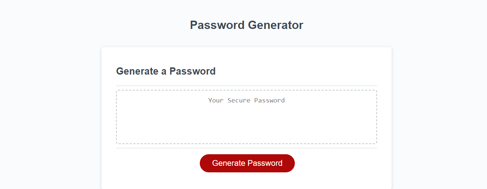

# Password Generator
Password Generator Project

## Description

The purpose of this Password Generator project was to teach bootcamp students how to use javascript to make a website function. Students had to write code in js including functions, if statements and for loops to ask the user what types of characters they would like used in the generated password. Those inputs from the user would then be used to generate a random password according to the users instructions. 

## Installation
N/A

## Usage

This website has one purpose, and that is to generate a random password given the input parameters from the user. After the user clicks on the "Generate Password" button, the window will then prompt them to answer a few questions. Those questions include, how long they want their password to be, and whether or not they want uppercase, lowercase, numeric and special characters to be included into their password. The user must follow a few rules pertaining to the way these questions are answered or inputted. An alert will pop up and the generator will not execute if an invalid input is entered. When asked how long they want their password to be, they cannot enter anything other than a number, and the number must be between 8 to 128 characters. For the following questions about what characters they want to be included, they must confirm at least one set of characters to be included into their password. After all the windows pop-ups are properly answered, a random password will be generated based on information from the user's previous inputs.  

<a href="https://github.com/elvislau74/password-generator">Click here for the GitHub Repository</a>

<a href="https://elvislau74.github.io/password-generator/">Click here for the Live Site</a>

## Credits
N/A

## License
Please refer to the LICENSE in the repo.
